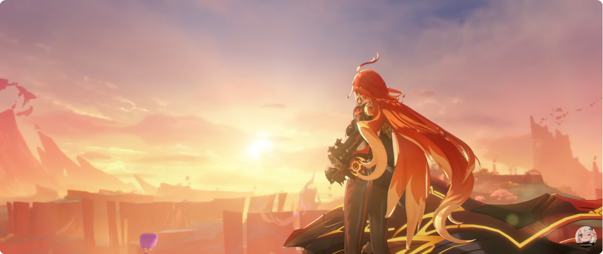

<!-- This is a comment -->
<!-- # Hey 👋, I'm Mavuika! -->

<h1 style="text-align:center;">Hey 👋, I'm Mavuika!</h1>

## 💫 About Me

I am a Full Stack Developer and Machine Learning Enthusiast with a huge love for Python, React.js, Node.js, Django, RDBMS, REST API and Data Visualization. I am also a huge fan of Genshin Impact and I love to play games in my free time.

- 🔭 I’m currently working on **[Project](https://...)**
- 🤝 I'm looking for help with **[Project](https://...)**
  - 🌱 I’m currently learning: Stuff
  - 📙 **Concepts**: Stuff
  - 👾 **Software**: Stuff
  - 🖥 **Hardware**: Stuff
- 💬 Ask me about **Natlan**
- 🔥 Fun fact - **I'm the Pyro Archon**
- 📫 How to reach me - [mavuika@genshin.com](mailto:mavuika@genshin.com)

## 🚀 Tech Stack
I like to keep my toolkit sharp and ready for any challenge:
- **Languages:** Python, JavaScript, TypeScript, SQL
- **Frameworks & Libraries:** React, Node.js, Django, Flask
- **Databases:** PostgreSQL, MySQL, MongoDB
- **Tools & Platforms:** Git, Docker, Kubernetes, AWS
- **Other:** RESTful APIs, GraphQL, Data Visualization, CI/CD

## 🌐 Connect with Me

Let's connect and chat! I am always open to meeting new people and learning new things. Feel free to reach out to me through my social media platforms:
- **Twitter:** [@mavuika](https://twitter.com/mavuika)
- **LinkedIn:** [Mavuika](https://www.linkedin.com/in/mavuika)
- **Discord:** [Join my server](https://discord.gg/mavuika)
- **YouTube:** [Mavuika Channel](https://www.youtube.com/mavuika)
- **Website:** [My Portfolio](https://yourwebsite.com)

## 🚀 Ride with Me to Victory!

